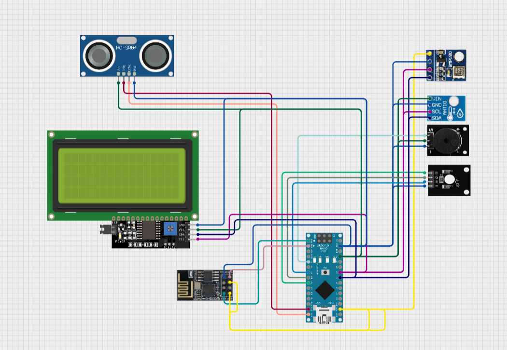

| HWMS project sheme |
| :----------------- |
|  |

| Used components |
| :-----------------|

| Component | Description |
| :--------- | :------------|
| AHT10 | Temperature and Humidity Sensor |
| BMP180 | Temperature, Humidity and Pressure Sensor |
| Buzzer | Buzzer module |
| RGB light | RGB light module |
| ESP 8266 (ESP 01) | wifi  module |
| HC-SR04 | ultrasonic distance reader |

| HWMS project pinout on Arduino NANO|
| :------------------- |

| Component | Pins |
| :-------- | :------- |
| AHT10 | GND -> GND; VCC -> 5V; SDA -> A4; SCL -> A5 |
| BMP180 | GND -> GND; VCC -> 3.3V; SDA -> A4; SCL -> A5 |
| LCD2004 I2C | GND -> GND; VCC -> 5V; SDA -> A4; SCL -> A5 |
| Buzzer | GND -> GND; VCC -> 5V; S -> D2 |
| RGB light | GND -> GND; R -> D4; G -> D5; B -> D6 |
| ESP 8266 (ESP 01) | GND -> GND; TX -> RX0 (RX); GPIO2 -> None; CH_PD - 3.3V; GPIO0 -> None; RST -> None; VCC -> 3.3V; RX -> TX1 (TX) |
| HC-SR04 | GND -> GND; VCC -> 5V; Echo -> 12; Trig -> 11 |

## Work
