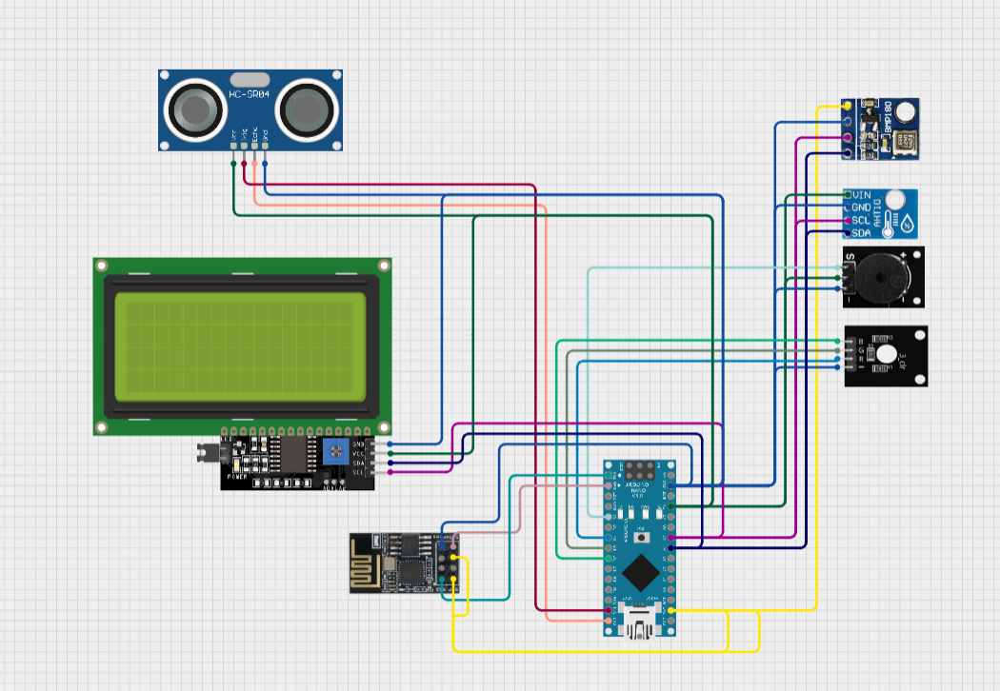

# HWMS

<h1>Home Weather Monitoring System🌤️</h1>

Multifunctional home wifi weather station capable of reading temperature, humidity, atmospheric pressure, as well as calculating the quality of indicators.

| HWMS project sheme |
| :----------------- |
|  |
